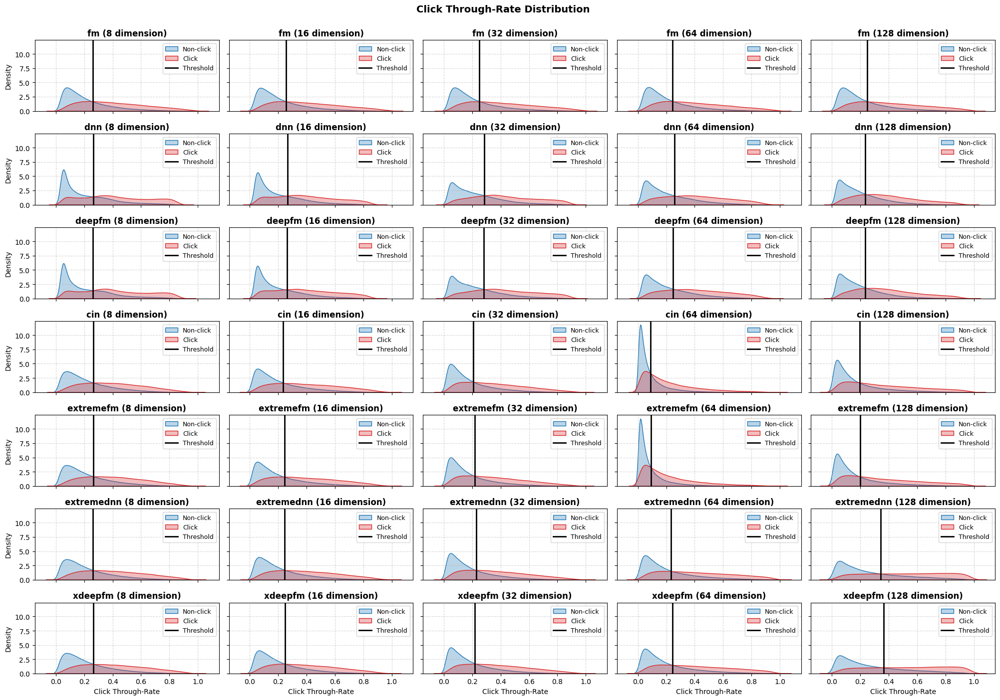
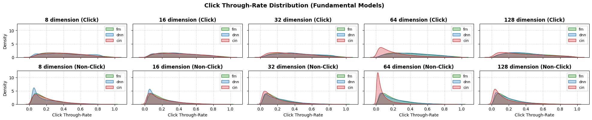
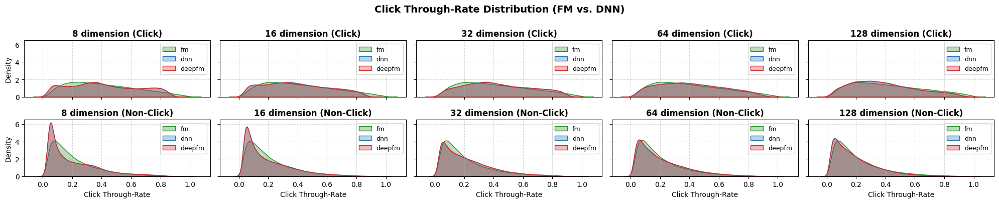
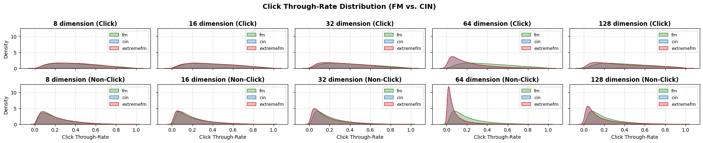
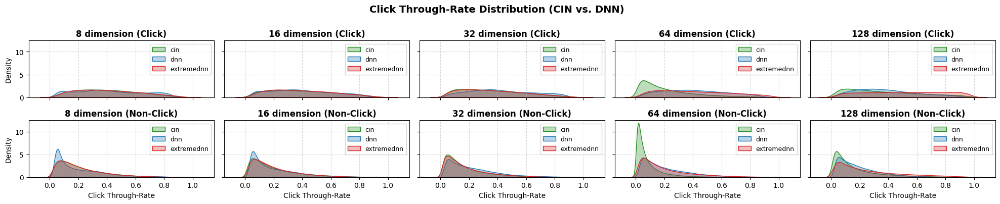
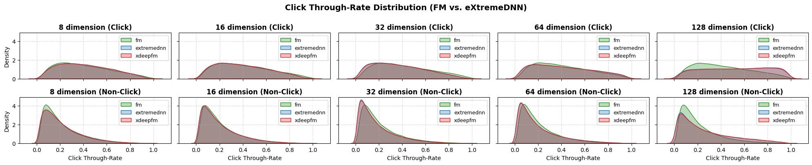
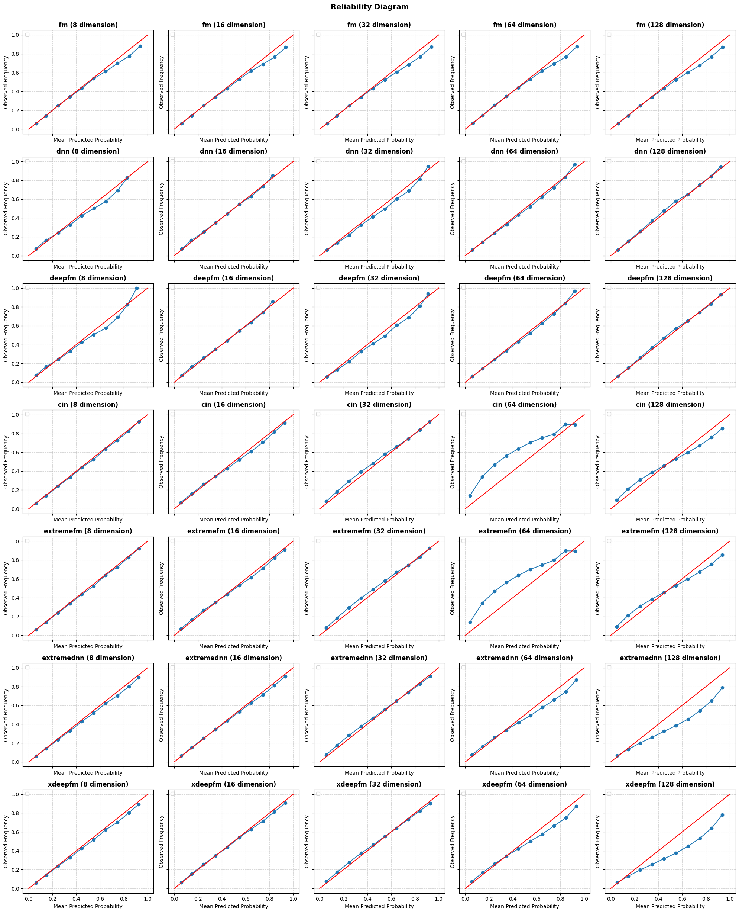
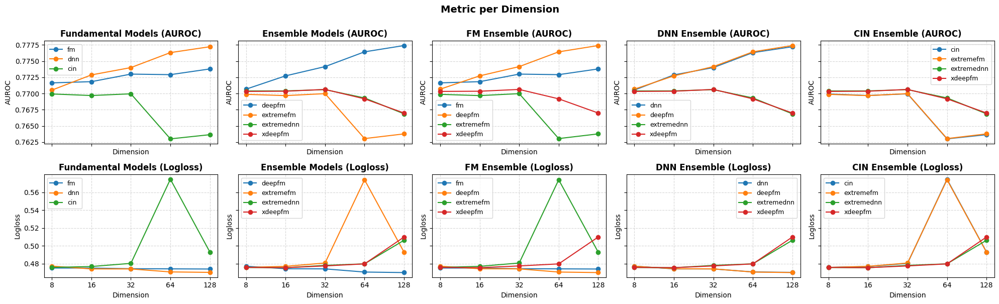

# 클릭률 예측 모형에서 교호작용 메커니즘에 대한 귀납적 편향이 예측력에 미치는 효과 연구: Criteo 데이터 셋을 중심으로

- 수행 기간: 2023.11.

- 수정 기간: 2026.02.

- 구성원: [`Wang,J.`](https://github.com/jayarnim)

## 개요

클릭률 예측 문제에서는 단일 변수의 주효과보다는 변수들 간 교호작용 효과를 모델링하는 것이 예측력을 개선하는데 효과적이다. 하지만 교호작용 행렬을 직접 추정하기에는 데이터가 희소하다는 한계점이 있었다. 클릭률 예측 모형의 원형이 되는 팩토리제이션 머신(Factorization Machine)은 교호작용 행렬을 저차원 좌표계로 분해(Matrix Factorization)함으로써 문제를 해결하였다. 이후 클릭률 예측 모형은 교호작용 항의 모델링에 중점을 두고 발전해왔다. 후속 모형들의 주요 차이점은 첫째, 저차 교호작용을 각각 모델링하여 집계하는가 혹은 고차 교호작용을 직접 모델링하는가, 둘째, 귀납적 편향을 제공하는가로 요약될 수 있다. 여기서 귀납적 편향(Inductive Bias)이란 교호작용 메커니즘에 관한 사전 가정으로서, 주로 쌍선형(Bi-Linear) 관계 구조가 가정되고 있다. 본 연구는 이 귀납적 편향의 유무가 모델링 대상의 복잡도에 따라 예측력에 미치는 효과를 확인하고자 하였다.

우선, 교호작용 항을 (1) 벡터 결합 함수, (2) 교호작용 모델링 함수, (3) 교호작용 집계 함수의 세 컴포넌트로 분해하여 FM(Rendle, 2010), DeepFM(Guo et al., 2017), xDeepFM(Lian et al., 2018)이 모델링하는 교호작용 효과와 그 가정을 구분하였다. 이를 통해 각 모형을 (1) 귀납적 편향 하에 2차 교호작용을 모델링하는 모형, (2) 귀납적 편향 없이 고차 교호작용을 모델링하는 모형, (3) 귀납적 편향 하에 고차 교호작용을 모델링하는 모형으로 체계화하였다. 이 분류 체계를 기반으로 모델링 대상에 따라 귀납적 편향이 예측력에 미치는 영향을 실험적으로 분석하였다. 실험 결과, 저차 교호작용을 모델링할 때는 단순화된 가정 하에 임베딩의 표현력만으로도 추정 안정성이 확보되었다. 하지만 고차 교호작용 모델링 시에는 가정이 부재할 때 예측력이 개선되었다. 반대로 선형 관계 구조를 귀납적 편향으로 제공하는 경우에는 제공된 귀납적 편향이 관계 구조의 복잡도를 충분히 반영하지 못하여 예측력이 저하되었다. 따라서 관계 구조가 복잡할수록 사전 정의된 귀납적 편향보다 데이터 기반의 매칭 함수 학습이 예측력 향상에 효과적이다.

종합하자면, 선형 관계 구조를 가정하는 모형은 연산 과정이 명시적(Explicit)이라는 점에서 분석 목적에는 적합하지만, 가정의 제약으로 인하여 표현력에 한계가 있어 예측력을 기대하기 어렵다는 것이 일반적인 통념이다. 그러나 귀납적 편향에 상응하는 변수 설계가 수반되는 경우, 외부 교란에도 강건한 예측력을 확보할 수 있음을 확인하였다. 또한, 귀납적 편향을 부여하지 않는 인공신경망 기반 모형은 높은 자유도로 인하여 과적합 가능성이 제기되어 왔다. 그러나 모델링 대상의 복잡도가 높은 경우에는 이 자유도에 기반하여 데이터로부터 관계 구조를 학습함으로써 희소한 환경에서도 우수한 예측력을 보일 수 있음을 확인하였다. 이상의 결과는 귀납적 편향에 적합한 변수 설계가 이루어진 경우 강건한 예측력을 기대할 수 있지만, 그렇지 못한 경우에는 데이터로부터 그 구조를 학습하는 컴포넌트를 도입하는 것이 효과적임을 시사한다.

한편, 미클릭 샘플의 클릭률을 확정적으로 낮추는 것은 오히려 추정 안정성이 저하되는 결과로 귀결된다. 이는 클릭률 예측 모형이 전제하는 최상위 가정에서 기인한다. 즉, 클릭/미클릭 이벤트는 사용자와 아이템,그리고 이를 둘러싼 맥락들 간 교호작용(매칭)으로써 발생한다는 가정이다. 그런데 클릭률 예측 데이터 셋은 대체로 범주형 변수들로 구성된다. 이 경우 발생 가능한 변수 조합이 수치형 변수로 구성될 때보다 한정적이다. 때문에 클릭과 미클릭의 설명변수 조합이 상이하지 않을 수 있다. 다시 말해, 동일하거나 유사한 설명변수 조합에서 클릭과 미클릭 이벤트가 모두 관측될 수 있다. 따라서 이 귀납적 편향 하에서는 미클릭 샘플에 지나치게 낮은 클릭률을 부여하는 경우 이와 변수 구성이 유사한 클릭 샘플을 과소추정할 가능성이 높다. 결론적으로, 이는 귀납적 편향이 모형 구성 상의 편의를 도모하기 위하여 도입되는 가정이 아니라, 모형이 관측된 현상을 재조직하고 새로운 관측에 대해 추론하는 기저 원리로 기능함을 입증한다고 볼 수 있다.

## Factorization Machines

팩토리제이션 머신(Factorization Machine)이란 고차원 희소 데이터(High-order Sparse Data)에서 변수 간 교호작용 효과(Interaction Effect) 학습의 한계점을 해결하기 위해 제안된 모형이다. 클릭율 예측 문제에서는 변수의 주효과(Main Effect)보다는 특정 변수들(특히 범주형 변수들) 간 매칭 성립 여부가 클릭에 더 큰 영향을 미칠 수 있다. 하지만 데이터가 희소할 경우, 두 변수 간 매칭이 성립한 샘플이 충분하지 않아 교호작용 효과 $w_{i,j}$ 를 직접 추정하기 어려웠다.

이에 팩토리제이션 머신은 가중치 행렬 $W\in\mathbb{R}^{P\times P}$ 을 저차원 잠재요인 행렬 $V\in\mathbb{R}^{P\times K}$ 로 분해하여 교호작용 효과를 변수들의 저차원 잠재요인 벡터 간 내적 $w_{i,j}\approx\langle v_{i},v_{j}\rangle$ 으로 근사하였다. 그 결과, 추정해야 하는 파라미터 공간이 $\mathcal{O}(p^{2})$ 에서 $\mathcal{O}(pk)$ 로 감소하였으며, 특히 관측 데이터 상에서 매칭이 성립하지 않은 두 변수 간 교호작용 효과를 잠재요인 벡터 간 내적으로 추정할 수 있게 되었다. 이후 후속 연구들은 교호작용 항의 표현력을 강화하는 방향으로 전개되고 있다.

$$\begin{aligned}
\hat{y}
&=\beta_{0}+\sum_{i}{\beta_{i}x_{i}}+f(X)
\end{aligned}$$

팩토리제이션 머신 및 그 후속 모형들의 기본 형태는 위 수식과 같다. 여기서 $\beta_{0}$ 은 편향, $\sum_{i}{\beta_{i}x_{i}}$ 은 변수의 주효과, $f(X)$ 는 변수들 간 교호작용 효과를 나타낸다. 본 연구에서는 Factorization Machine(Rendle, 2010), Deep Factorization Machine(Guo et al., 2017), eXtreme Deep Factorization Machine(Lian et al., 2018) 를 살펴볼 계획이다. 해당 모형들이 제안하는 교호작용 항을 (1) 벡터 결합 함수(Pair Construction Function) (2) 교호작용 모델링 함수(Interaction Modeling Function) (3) 교호작용 집계 함수(Interaction Aggregation Function)로 세분화하면 다음과 같다.

| | Pair Construction | Interaction Modeling | Interaction Aggregation |
|---|---|---|---|
| FM | Pairwise Pairing | Element-wise Product | Uniform Sum |
| DNN | Concatenation | Multi-Layer Perceptron | Weighted Sum |
| CIN | Pairwise Pairing | Outer Product</br>$1\times 1$ Convolution | Uniform Sum |

$$\begin{aligned}
f_{\mathrm{FM}}(X)
&=\sum_{(i,j)}{\langle v_{i},v_{j}\rangle x_{i}x_{j}}\\
&=\sum_{(i,j)}\sum_{k}{v_{i}x_{i}\odot v_{j}x_{j}}
\end{aligned}$$

위 수식은 Factorization Machine(Rendle, 2010)에서 제안하고 있는 교호작용 효과인 `F`actorization `M`achine(FM)이다. 벡터 결합 함수(Pair Construction Function)는 쌍별 결합(Pairwise Pairing), 교호작용 모델링 함수(Interaction Modeling Function)는 임베딩 공간 차원별 곱셈(Element-wise Product), 교호작용 집계 함수(Interaction Aggregation Function)는 임베딩 공간 차원별 교호작용 정보 누적 연산(Uniform Sum)이 된다. 따라서 해당 모형은 교호작용 메커니즘을 사전 규정하여 2차 효과만을 모델링하고 있음을 확인 가능하다.

$$\begin{aligned}
f_{\mathrm{DNN}}(X)
&= \mathrm{MLP}_{\mathrm{ReLU}}\left(\left[\cdots \oplus v_{i}x_{i} \oplus v_{j}x_{j} \oplus \cdots \right]\right)
\end{aligned}$$

위 수식은 Deep Factorization Machine(Guo et al., 2017)에서 제안하고 있는 교호작용 효과인 `D`eep `N`eural `N`etworks(DNN)이다. 벡터 결합 함수(Pair Construction Function)는 벡터 결합(Concatenation), 교호작용 모델링 함수(Interaction Modeling Function)는 `M`ulti-`L`ayer `P`erceptron(MLP), 교호작용 집계 함수(Interaction Aggregation Function)는 그 출력 레이어로서 가중합 연산(Weighted Sum)이 된다. 따라서 해당 모형은 교호작용 메커니즘을 관측값으로부터 학습하여 고차 효과를 모델링하고 있다고 볼 수 있다.

$$\begin{aligned}
f_{\mathrm{CIN}}(X)&=\mathrm{Linear}\left(\left[H^{(1)} \oplus \cdots \oplus H^{(K)}\right]\right)\\
H^{(k)}&=\mathrm{SumPooling}\left(X^{(k)}\right)\\
X^{(k)}&=\mathrm{Conv1D}_{(1,1)}\left(Z^{(k)}\right)\\
Z^{(k)}
&=X^{(0)} \otimes X^{(k-1)}\\
X^{(0)}&=\begin{pmatrix}\cdots & v_{i}x_{i} & v_{j}x_{j} &\cdots \end{pmatrix}^{T}
\end{aligned}$$

위 수식은 eXtreme Deep Factorization Machine(Lian et al., 2018)에서 제안하고 있는 교호작용 효과인 `C`ompressed `I`nteraction `N`etworks(CIN)이다. 벡터 결합 함수(Pair Construction Function)는 쌍별 결합(Pairwise Pairing), 교호작용 모델링 함수(Interaction Modeling Function)는 외적(Outer Product) 및 $1\times 1$ Convoluation, 교호작용 집계 함수(Interaction Aggregation Function)는 피처 맵(Feature Map) 정보 누적 연산(Sum Pooling) 및 누적된 피처 맵 정보의 가중합 연산(Weighted Sum)이 된다.

교호작용 모델링 함수의 연산 과정을 구체적으로 살펴보면, 우선, 성립 가능한 2차 교호작용 쌍(Pair)에 대하여 차원별 곱셈(Element-wise Product)을 수행하여 동차원 교호작용 값을 도출한다(Outer Product). 이후 모든 쌍에 대한 `channels` 개의 선형결합을 차원별로 도출한다($1\times 1$ Convoluation). 합성곱 계층의 수가 총 $N$ 장이라고 한다면, CIN은 총 $N+1$차 교호작용의 선형결합을 도출하게 된다. 즉, 고차 상호작용 효과를 모델링함에 있어, DNN은 메커니즘을 관측 데이터로부터 학습하는 반면, CIN은 이를 요소별 곱셈으로 사전 규정한다는 점에서 차이가 있다.

## 실험

실험에는 다음의 데이터 셋을 활용하였다:

- Kaggle Display Advertising dataset [`link`](https://ailab.criteo.com/ressources/)

위 데이터 셋은 맞춤형 개인화 광고 서비스 플랫폼 크리테오(Criteo)에서 제공하는 데이터 셋으로서 광고가 노출된 맥락과 클릭 여부에 관한 정보를 담고 있다. 편의상 일부만을 샘플링하여 실험에 사용하였으며, 샘플링 전/후 샘플 수는 아래 표와 같다. 반응변수가 되는 클릭과 미클릭의 비율은 약 `1:3` 으로, 범주 간 불균형 문제가 있다. 다만, 클릭률 예측 문제에서는 클릭 이벤트 발생 횟수가 상대적으로 적다는 점을 고려하면 비율 조정할 수준이라 보기 어렵다. 설명변수는 수치형 변수 13개, 범주형 변수 26개로 구성되어 있다. 본 연구에서는 수치형 변수에 대하여 분산 안정화와 변수 간 스케일 안정화를 도모하기 위하여 로그 변환(Log Transform)과 표준화(Standardization)를 수행하였다.

| | origin | sampling |
|---|---|---|
| total | $45,840,617$ | $1,000,000$ |
| click | $11,745,438$ | $256,223$ |
| non-click | $34,095,179$ | $743,777$ |
| ratio | $1:2.9$ | $1:2.9$ |

훈련(`trn`), 검증(`val`), 평가(`tst`) 데이터 셋은 샘플링된 데이터 셋을 `6:2:2` 의 비율로 층화 분할하여 구성하였다. 훈련 데이터 셋의 손실함수로는 BCE(`B`inary `C`ross `E`ntropy)를 사용하였으며, 검증 데이터 셋에 대하여 AUROC(`A`rea `U`nder the `R`eceiver `O`perating `C`haracteristic) 기준 5회 이상 개선되지 않을 경우 조기 종료하였다. 평가 데이터 셋 성능 평가 지표로는 혼동 행렬(Confusion Matrix), 정확도(Accuracy), 정밀도(Precision), 재현율(Recall), f1 스코어(f1-Score), AUROC, Logloss(BCE)를 사용하였다. 이때 혼동 행렬, 정확도, 정밀도, 재현율, f1 스코어 산출 시에는 검증 데이터 셋에서 성능이 가장 향상되었을 때의 유덴 지수(Youden's J Statistic; J)를 임계값으로 사용하였다. 이는 민감도(Sensitivity)와 특이도(Specificity)를 활용하여 산출된다.

$$
J:=TPR+(1-TNR)-1
$$

단, 성능 분석에서는 AUROC와 Logloss만을 사용하였다. 이는 클릭률 예측 문제에서는 범주를 정확하게 판별하는 것보다는 클릭 샘플의 클릭률을 미클릭 샘플의 클릭률보다 높게 예측하는 것이 중요하기 때문이다.

## 결과

| | FM | DNN | CIN |
|---|---|---|---|
| Factorization Machine | O | X | X |
| Deep Neural Networks | X | O | X |
| Deep Factorization Machine | O | O | X |
| Compressed Interaction Networks | X | X | O |
| eXtreme Factorization Machine | O | X | O |
| eXtreme Deep Neural Networks | X | O | O |
| eXtreme Deep Factorization Machine | O | O | O |

앞서 살펴본 교호작용 수식으로부터 각 모형들의 모델링 방식을 두 가지 기준에서 구분할 수 있다. 첫째, 교호작용 차수(2-way vs. high-order)이다. FM은 클릭 혹은 미클릭 이벤트가 발생 가능한 모든 엔티티(변수) 쌍의 저차 교호작용 정보에 대한 집계(Aggregated Pairwise Interactions)로써 설명된다고 가정한다고 볼 수 있다. 반면, DNN과 CIN은 모든 엔티티(변수)가 동시에 참여하는(joint interaction) 고차 교호작용으로 설명되어야 함을 가정한다. 둘째, 교호작용 메커니즘에 대한 가설, 즉 귀납적 편향(Inductive Bias) 설정 여부이다. FM과 CIN은 교호작용 메커니즘에 대하여 쌍선형(Bi-Linear) 구조를 가정하는데 반해, DNN는 이러한 가설을 설정하지 않고 관계 구조를 관측 데이터로부터 학습하여 도출한다. 이상의 기저 모형(Fundamental Models)과 그 앙상블(Ensemble)을 위 표와 같이 조합하여 실험을 수행하였다.

### Click Through-Rate Distribution



위 그림은 모형별 임베딩 차수 변화에 따른 클릭 및 미클릭 샘플의 클릭률 분포와 최적 임계값을 나타낸 것이다. 전반적으로 모든 모형에서 클릭 샘플과 미클릭 샘플의 분포는 상당 부분 중첩되는 양상을 보인다. 그러나 클릭 샘플은 전체 확률 구간에 걸쳐 비교적 완만하게 분포하는 반면, 미클릭 샘플은 대체로 낮은 클릭률 영역에 밀잡하여 분포한다. 이는 미클릭 이벤트가 상대적으로 특정 가능한 패턴에 기반하여 발생하는데 반해, 클릭 이벤트는 이질적인 요인들이 복합적으로 작용하여 발생함을 시사한다.

임베딩 차수 증가에 따른 분포 변화는 기저 모형에 따라 상이하다. 우선, Factorization Machine은 임베딩 차원의 변화에 따른 분포 형태의 변화가 거의 관찰되지 않았다. 반면, DNN과 DeepFM은 저차원에서 미클릭 분포의 폭이 상대적으로 좁은 형태를 보였으나, 차원수가 증가할수록 점차 넓어지는 경향이 관찰되었다. 한편, CIN과 eXtremeFM은 차원수가 증가함에 따라 클릭 및 미클릭 분포 모두 낮은 클릭률 영역으로 점차 밀집되는 양상을 보였다. 특히 본 실험에서는 64차원에서 이 현상이 가장 두드러졌다.

최적 임계값 역시 임베딩 차원 증가에 따라 전반적으로 감소하는 경향을 보였다. 특히 CIN과 eXtremeFM은 다른 모형들에 비해 전반적으로 더 낮은 임계값을 형성하였다. 단, 대부분의 모형에서는 128차원에서 가장 낮은 임계값을 형성한 반면, CIN과 eXtremeFM은 64차원에서 임계값이 큰 폭으로 감소한 이후 128차원에서 다시 증가하였다. 다만, 128차원에서의 임계값 역시 32차원에 비해서는 낮은 수준을 유지하였다. 예외적으로, eXtremeDNN과 xDeepFM은 128차원에서 최적 임계값이 다시 증가하여 가장 높은 값을 나타냈다.

### Versus

앞서 확인한 모형별 클릭률 분포를 비교하기 위하여 기저 모형과 앙상블 모형 간 클릭률 분포를 아래와 같이 시각화하였다. 모든 그림에서 클릭 샘플의 클릭률 분포는 교호작용 항이나 임베딩 차수의 변화에 큰 차이를 보이지 않았으며, 미클릭 샘플과 비교했을 때 전 확률 구간에 걸쳐 완만한 형태를 유지하였다. 반면, 미클릭 샘플의 클릭률 분포는 교호작용 항과 임베딩 차수에 따라 차이를 보였다. 이는 클릭률 예측 모형의 성능이 클릭 샘플보다는 미클릭 샘플에 대한 예측력에서 비롯될 가능성을 시사한다.



위 그림은 기저 모형인 FM, DNN, CIN의 클릭률 분포를 비교한 것이다. FM은 임베딩 차수가 증가하더라도 클릭 및 미클릭 샘플 모두에서 그 분포가 거의 변화하지 않았다. 반면, DNN은 저차원에서 미클릭 샘플의 클릭률이 낮은 영역에 상대적으로 밀집되어 있었으나, 임베딩 차수가 증가함에 따라 분포가 점차 완만해지는 경향을 보였다. 이와는 대조적으로 CIN은 저차원에서는 비교적 완만한 분포를 형성하였으나, 차원이 증가할수록 미클릭 샘플의 클릭률이 점차 낮은 영역으로 집중되는 양상을 보였다. 특히 본 실험에서는 64차원에서 이러한 현상이 가장 두드러졌으며, 이는 CIN의 실험 설정 하 특정 데이터 셋(Criteo)에서 나타난 특수한 결과로 판단된다.





FM과 DNN을 결합한 DeepFM의 경우, 클릭 및 미클릭 샘플 모두에서 DNN과 거의 동일한 분포를 형성하였다. 특히 미클릭 샘플의 경우, 저차원에서는 DNN과 함께 FM보다 낮은 클릭률 영역에 상대적으로 밀집된 형태를 보였으나, 차원이 증가할수록 점차 완만해져 FM의 분포와 유사한 형태로 수렴하는 경향이 관찰되었다. 반면, FM과 CIN을 결합한 eXtremeFM은 전반적으로 CIN과 거의 동일한 분포를 유지하였다. 특히 차수가 증가할수록 미클릭 샘플이 낮은 클릭률 영역으로 집중되는 경향 역시 유지되었으며, 64차원에서 관찰된 분포의 급격한 밀집 현상 또한 CIN과 거의 동일하게 나타났다. 이는 FM을 추가하더라도 고차 교호작용 모형의 출력값 분포가 크게 변화하지 않음을 보여준다.





CIN과 DNN을 결합한 eXtremeDNN은 기저 모형들과 상이한 분포를 형성하였다. 클릭 샘플의 분포는 저차원에서는 기저 모형들과 큰 차이를 보이지 않았으나, 고차원으로 갈수록 전체 확률 구간에 걸쳐 보다 완만한 형태를 나타냈다. 미클릭 샘플의 경우에는 32차원을 기점으로 CIN과 DNN의 분포와 차이를 보이기 시작하였으며, 고차원에서는 낮은 클릭률 영역에서 CIN, DNN보다 완만한 분포가 형성되었다. FM을 추가한 xDeepFM 역시 eXtremeDNN과 거의 동일한 분포를 유지하였다. 종합하자면, FM을 포함하는 앙상블(DeepFM, eXtremeFM, xDeepFM)에서는 결합 모형의 클릭률 분포를 유지하는 반면, DNN과 CIN을 결합한 eXtremeDNN에서는 기저 모형과 구별되는 새로운 클릭률 분포가 형성된다. 이러한 결과는 저차 교호작용 모델링 컴포넌트와 고차 교호작용 모델링 컴포넌트가 수행하는 기능이 구분될 수 있다는 점을 암시한다고 볼 수 있다.

### Reliability Diagram



위 그림은 예측 클릭률을 동일한 간격(bin=10)으로 분할한 후 각 구간에서의 평균 예측 클릭률과 실제 클릭률을 비교한 신뢰도 다이어그램(Reliability Diagram)이다. 이상적인 경우 모든 점은 $y=x$ 직선에 위치하며, 직선으로부터의 편차가 클수록 클릭률 추정 안정성(Calibration)이 저하되었음을 의미한다. 직선을 상회하는 경우에는 클릭률을 과소추정하였음을 나타내고, 하회하는 경우에는 과대추정하였음을 나타낸다.

FM의 경우 신뢰도 곡선이 전반적으로 직선에 근접한 형태를 유지하였으며, 임베딩 차수가 증가하더라도 그 형태가 거의 변화하지 않았다. 다만 클릭률이 높은 구간에서만 실제보다 과대추정하는 경향이 관찰되었다. DNN과 DeepFM의 경우 모든 임베딩 차수에서 기준선에 근접하였으나, 저차원보다는 고차원으로 갈수록 기준선에 안정적으로 안착하는 양상을 보였다. 또한 저차원에서는 클릭률이 높은 구간에 해당하는 샘플이 거의 존재하지 않아, 해당 구간의 추정 안정성(Calibration)을 확인하기 어려웠다. 하지만 임베딩 차수가 증가할수록 해당 구간까지 곡선이 확장되었으며, 추정 안정성(Calibration) 역시 확보되었다.

이와 반대로, CIN과 eXtremeFM은 저차원에서는 추정 안정성(Calibration)을 확보하였으나, 고차원으로 갈수록 기준선으로부터 점차 이탈하는 경향을 보였다. 특히 64차원에서는 대부분의 구간에서 과소추정(under-estimation)하는 경향이 두드러졌다. 또한 128차원에서는 낮은 예측확률 구간에서는 과소추정, 높은 예측확률 구간에서는 과대추정(over-estimation) 현상이 관찰되었다. eXtremeDNN과 xDeepFM은 CIN과 마찬가지로 저차원에서 추정 안정성(Calibration)을 유지하였으나, 차수가 증가할수록 불안정해지는 경향을 보였다. 단, CIN의 경우 과소추정이 두드러진 반면, eXtremeDNN의 경우 과대추정이 두드러졌다.

종합하자면, 신뢰도 다이어그램에서도 클릭률 분포에서 확인된 바와 유사한 현상이 관찰된다. 우선, FM은 임베딩 차수의 변화에 강건하였으며, (DNN과 DeepFM), (CIN과 eXtremeFM), (eXtremeDNN과 xDeepFM)은 각각 유사한 경향을 보였다. 반면, eXtremeDNN은 DNN과 CIN 중 어느 한쪽과 유사한 경향을 보인다고 보기 어려웠다. 물론, 고차원으로 갈수록 추정 안정성(Calibration)이 저하된다는 점은 CIN과 유사하지만, CIN은 이 현상이 과소추정으로 나타나는데 반해, eXtremeDNN은 과대추정으로 나타났다.

### Metric



성능 지표를 비교 분석하기에 앞서, 앞선 결과를 종합하면 다음의 네 가지 특징을 확인할 수 있다. 첫째, FM은 임베딩 차수 변화에 강건하다. 둘째, FM은 고차 교호작용 모형과 앙상블을 구성하였을 때 출력값 분포에 직접적으로 영향을 미치지 않는다. 셋째, 고차 교호작용 모형 간 앙상블에서는 새로운 출력값 분포가 형성되었다. 넷째, 고차 교호작용 모델링 시 임베딩 차수의 변화는 귀납적 편향 여부에 따라 서로 다른 영향을 미친다. DNN, DeepFM은 차원이 증가할수록 미클릭 샘플의 출력값 분포가 점차 완만해지고 추정 안정성이 향상되었다. 반면, CIN, eXtremeFM은 미클릭 샘플의 출력값 분포가 지나치게 낮은 클릭률 영역에 밀집되면서 과소추정이 심화되었다. 한편, eXtremeDNN, xDeepFM은 미클릭 샘플의 출력값 분포는 점차 완만해졌으나 과대추정이 심화되는 경향을 보였다.

AUROC, Logloss에서도 출력값 분포 및 신뢰도 다이어그램과 유사한 현상이 관찰되었다. 우선, 기저 모형 중에서는 DNN이 가장 우수한 성능을 나타낸 반면, CIN은 가장 저조한 성능을 기록하였다. 또한 DNN 계열은 인베딩 차수가 증가할수록 성능이 향상된 것에 반해, CIN 계열은 악화되었다. 특히 과소추정이 심화되었던 64차원에서 CIN의 성능 저하 현상이 가장 두드러졌다. 한편, FM은 모든 차원에서 안정적인 성능을 유지하면서도 고차원으로 갈수록 성능이 소폭 향상되었다. 앙상블 모형 역시 앞선 결과와 동일한 양상을 보였다. DeepFM은 DNN과, eXtremeFM은 CIN과, xDeepFM은 eXtremeDNN과 유사한 추이를 보였다. 단, eXtremeDNN은 CIN과 유사한 성능 변화 추세를 보였으나, CIN보다 우수한 성능을 유지하였다.

## 결론

이상의 결과로부터 두 가지 시사점을 도출할 수 있다.

첫째, 클릭률 예측 문제에서는 미클릭 샘플의 출력값 분포를 안정적으로 형성하는 것이 예측 성능 향상에 직결된다. 단, 미클릭 샘플의 클릭률을 낮게 추정하는 것이 반드시 성능 향상으로 귀결된다고 볼 수 없다. 그 근거로, DNN 계열 모형이 미클릭 샘플의 출력값 분포가 점차 완만해질수록 추정 안정성이 확보되고 성능이 개선된 반면, CIN 계열 모형은 미클릭 샘플을 낮은 클릭률 영역에 밀집시킬수록 과소추정의 문제가 발생하여 성능이 저하되었다. 특히 과소추정이 가장 두드러졌던 64차원에서 CIN의 성능이 크게 하락하였다. 과대추정 경향을 보인 eXtremeDNN 계열 모형이 CIN 계열 모형보다 성능이 우수하였음을 고려했을 때, 과소추정이 과대추정보다 성능 저하로 귀결될 여지가 크다.

이러한 결과는 클릭률 예측 모형의 구조와 데이터 셋 변수 구성에서 그 원인을 찾아볼 수 있다. 클릭률 예측 모형은 다수의 교호작용 정보를 집계하여 최종 클릭률을 산출한다. 그런데 클릭률 예측 데이터 셋은 대체로 범주형 변수로 구성되므로, 유사한 변수 조합이 빈번하게 관측될 가능성이 높다. 다시 말해, 클릭 샘플과 미클릭 샘플의 변수 조합이 소수의 조합에 의해 구분될 뿐, 전반적으로는 유사한 조합으로 구성될 수 있다. 따라서 미클릭 샘플에 대하여 지나치게 낮은 클릭률을 부여할 경우, 변수 구성이 유사한 클릭 샘플까지 함께 과소추정될 가능성이 있으며, 이러한 추정 안정성의 저하는 최종 예측 성능 저하로 이어질 수 있다.

둘째, 교호작용 항을 임베딩 표현 학습(Representation Learning)과 매칭 함수 학습(Matching Function Learning)의 두 컴포넌트로 해석할 수 있다. 이때 모형의 예측력은 교호작용의 복잡도가 증가할수록 임베딩 표현 학습보다 매칭 함수 학습에 좌우되는 경향이 있다. 표현 학습(Representation Learning)은 고차원 관측 공간으로부터 데이터가 형성하는 잠재 구조(Latent Structure)를 포착하고, 이를 효과적으로 표현할 수 있는 저차원 좌표계(Latent Space)를 학습하는 것을 목적으로 한다. 그런데 클릭률 예측 문제에서 관측 공간은 개별 엔티티가 아니라 사용자, 아이템 및 컨텍스트 등 다양한 엔티티 간의 교호작용으로 구성된다. 이때 표현 학습은 관측된 교호작용으로부터 각 엔티티의 잠재요인(Latent Factor)을 추론하는 과정이 된다. 여기서 잠재요인은 다른 엔티티와의 관계를 생성하는 요인으로 이해될 수 있다. 

FM과 CIN은 모두 요소별 곱셈(Element-wise Product)만으로 엔티티들의 교호작용을 모델링한다. 이때 요소별 곱셈(Element-wise Product)은 교호작용에 대한 쌍선형(Bi-Linear) 구조와 차원별 분리 가정을 전제한다. 다만, FM은 2차 교호작용만을 모델링하는 반면, CIN은 동일한 연산 구조를 반복하여 고차 교호작용을 모델링한다. 이처럼 교호작용 모델링 함수가 특정되었을 때는 예측력이 학습된 임베딩 표현의 품질에 전적으로 의존하게 된다. 이는 함수가 학습 대상이 아니라 연구자가 사전에 규정한 귀납적 편향으로 작용하기 때문이다. 반면, DNN은 고차 교호작용 메커니즘을 사전에 가정하지 않고, 데이터로부터 이를 모델링하는 함수를 직접 학습한다.

실험 결과, FM은 임베딩 차원의 변화에 강건한 예측력을 유지하며 클릭 샘플의 클릭률을 미클릭 샘플보다 지속적으로 높은 수준에 배치하였다. 반면, CIN은 임베딩 차수가 증가하여 표현 공간이 확대되었음에도 불구하고, 고차 교호작용의 다양성과 복잡성을 충분히 반영하지 못하여 추정 안정성이 저하되었다. 한편, DNN은 임베딩 차수가 증가할수록 추정 안정성이 개선되어 예측력이 점차 향상되었다. 이는 고차 교호작용에서는 관측 공간이 제공하는 정보의 다양성과 복잡성이 크게 증가하는 데서 비롯한다. 때문에 사전에 설계된 귀납적 편향이 실제 관계 구조의 복잡도를 충분히 감당하지 못할 경우, 해당 정보로부터 엔티티의 잠재요인을 식별하기 어렵다. 따라서 고차 교호작용을 모델링할 때는 단순화된 귀납적 편향 하에서 임베딩의 표현력에 의존하기보다는 관측된 관계 구조 자체를 모델링하는 매칭 함수 학습이 수반될 필요가 있다.

## 스크립트

```bash
# INSTALL DEPENDENCIES
conda env create -f env/environment.yaml
conda activate ctr
```

- configuration files [`path`](config/)

- notebook
    - factorization machine [`path`](notebooks/fm/)
    - deep neural networks [`path`](notebooks/dnn/)
    - compressed interaction networks [`path`](notebooks/cin/)
    - deep factorization machine [`path`](notebooks/deepfm/)
    - extreme factorization machine [`path`](notebooks/extremefm/)
    - extreme deep neural networks [`path`](notebooks/extremednn/)
    - extreme deep factorization machine [`path`](notebooks/xdeepfm/)
    - analysis [`path`](notebooks/analysis.ipynb)

- source
    - model implementation [`path`](src/fm/)
    - experiment execution scripts [`repo`](https://github.com/jayarnim/pkg-ctr)
    - result analysis scripts [`path`](src/analysis/)